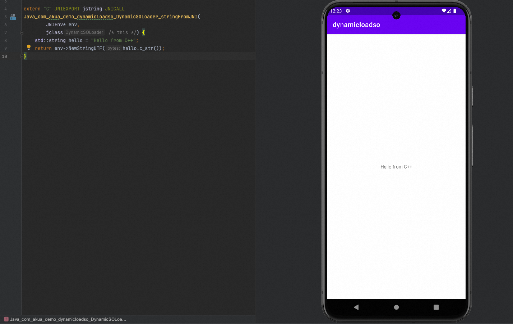
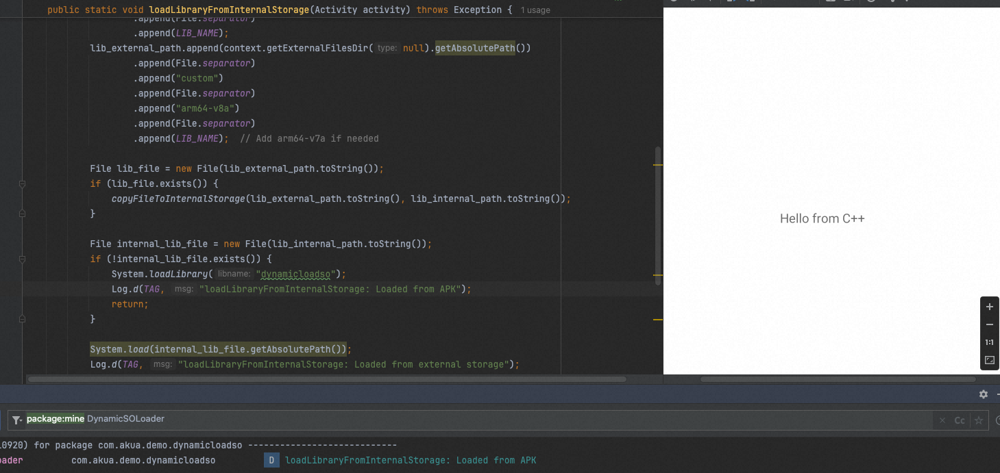
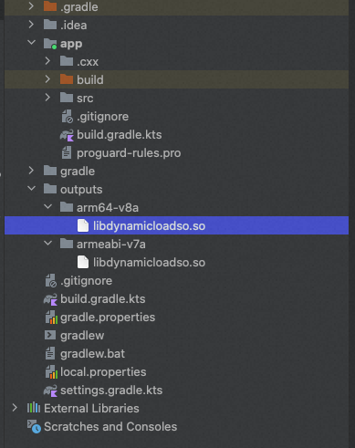
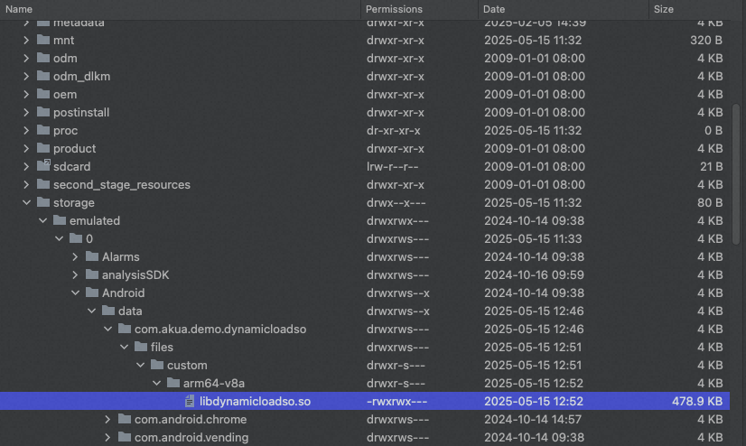
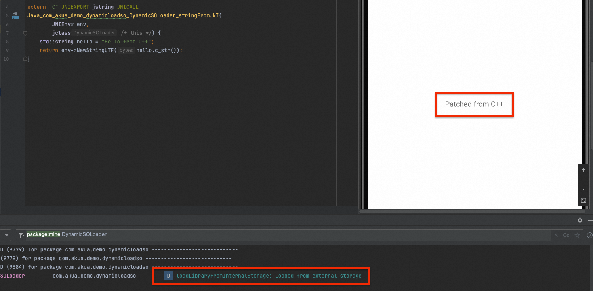

> ⚠️ 以下步驟僅適用於測試與Debug，不適用於Deployment階段，若要部署，可參考「Android Hotfix .so」

## 前言

在首次接觸NDK的時候，可以看到預設project使用`System.loadLibrary()`來靜態載入(static load).so檔案，這個方法會在APK的lib目錄下尋找.so檔案，並將其載入到應用程序中。使用這個方法時，需要將.so檔案打包到APK中，這樣在app啟動時就會自動載入這些庫。

```java
    static {
        System.loadLibrary("dynamicloadso");
    }
```

在一個不複雜的app中，這樣的做法是足以應付的，但如果形容程式的規模變大的時候，每次都要對so進行debug或者只是對so進行更新會花上很多時間re-build apk。為了解決這個問題，我們可以使用Android的動態載入so的功能，這樣就可以在不重新安裝APK的情況下使用Native庫

## 動態載入

Android動態載入so (Dynamic Load native library) 是一種在運行時載入Native庫的方法，這種方法可以在應用程序運行時根據程式運行邏輯自行選擇什麼時候才載入，並且不需要預先將.so檔案打包到APK中。

## Demo

- 假設我們有以下程式碼Native Code
```C++
extern "C" JNIEXPORT jstring JNICALL
Java_com_akua_demo_dynamicloadso_DynamicSOLoader_stringFromJNI(
        JNIEnv* env,
        jclass klass) {
    std::string hello = "Hello from C++";
    return env->NewStringUTF(hello.c_str());
}
```

- 而Java的程式碼定義為

```java
static {
    System.loadLibrary("dynamicloadso");
}

public static native String stringFromJNI();
```

### 原效果
  


### 從內部儲存(internal storage)載入原生程式庫

對Java程式碼做了一些改變，加入了一個`loadLibraryFromInternalStorage()` method.

```java
public static void loadLibraryFromInternalStorage(Activity activity) throws Exception {
    Context context = activity.getApplicationContext();

    try {
        StringBuilder lib_internal_path = new StringBuilder();
        StringBuilder lib_external_path = new StringBuilder();
        lib_internal_path.append(context.getFilesDir().getAbsolutePath())
                .append(File.separator)
                .append("custom")
                .append(File.separator)
                .append("arm64-v8a")
                .append(File.separator)
                .append(LIB_NAME);
        lib_external_path.append(context.getExternalFilesDir(null).getAbsolutePath())
                .append(File.separator)
                .append("custom")
                .append(File.separator)
                .append("arm64-v8a")
                .append(File.separator)
                .append(LIB_NAME);  // Add arm64-v7a if needed

        File lib_file = new File(lib_external_path.toString());
        if (lib_file.exists()) {
            copyFileToInternalStorage(lib_external_path.toString(), lib_internal_path.toString());
        }

        File internal_lib_file = new File(lib_internal_path.toString());
        if (!internal_lib_file.exists()) {
            System.loadLibrary("dynamicloadso");
            Log.d(TAG, "loadLibraryFromInternalStorage: Loaded from APK");
            return;
        }

        System.load(internal_lib_file.getAbsolutePath());
        Log.d(TAG, "loadLibraryFromInternalStorage: Loaded from external storage");

    } catch (Exception e) {
        throw new Exception("Failed to load library", e);
    }
}
```

> ⚠️ 通常情況下需要考慮CPU架構去載入其特定的so，但在demo中，只先考慮 arm64-v8a 

在這個code中，可以將它分成三個部分：

1. 從Activity取得內部和外部路徑 (Internal and External Storage)
   
   在 Android 中，我們只能從內部儲存空間或 apk/lib 目錄載入函式庫。某些手機裝置，可能會基於安全理由阻止普通用戶存取內部儲存裝置，例如 Samsung Knox / 安全資料夾。因此，我們需要額外的方法來從外部儲存載入函式庫，也就是將它複製到內部

2. 檢查和複製，在這部分檢查內部或外部儲存中是否存在已patched的so，如果是，則將其從外部複製到內部。

3. 從內部或 apk/lib 載入native library



### 僅Build Native Library

讓我們變更native function文字並重新建立 .so (但不rebuild整個 apk)

```C++
extern "C" JNIEXPORT jstring JNICALL
Java_com_akua_demo_dynamicloadso_DynamicSOLoader_stringFromJNI(
        JNIEnv* env,
        jclass klass) {
    std::string hello = "Patched from C++";
    return env->NewStringUTF(hello.c_str());
}
```

新增一項"僅建立native library so"任務

```gradle
tasks.register("BuildNativeLibToRootOnly") {
    group = "build"
    description = "Builds the native library and places it in the root directory."
    dependsOn("externalNativeBuildRelease")
    doLast {
        copy {
            from("$buildDir/intermediates/cmake/release/obj")
            into("$rootDir/outputs")
        }
    }
}
```

執行之後，我們可以看到project root中有一個 .so 檔案



將其放入 APK 外部儲存空間。



### 結果

無需重新安裝或更新 APK此情況下，我們可以看到文字被更改



## 總結

這個方法可以讓我們在不重新安裝APK的情況下，測試和debug Native庫，這樣可以節省大量時間並提高開發效率。就我個人而言，當我做一些遊戲模組時，它可以節省我重建遊戲APK的時間。除此之外，**這也是熱修(hotfix)的技術之一**。

### 注意事項

雖然dynamic load是一個非常方便的功能，但在使用時仍然需要注意一些**安全性**事項，從外部和內部儲存動態載入的.so檔案可能會很容易被惡意修改，為了安全起見加載時使用完整性檢查(integrity checking)等安全措施。
