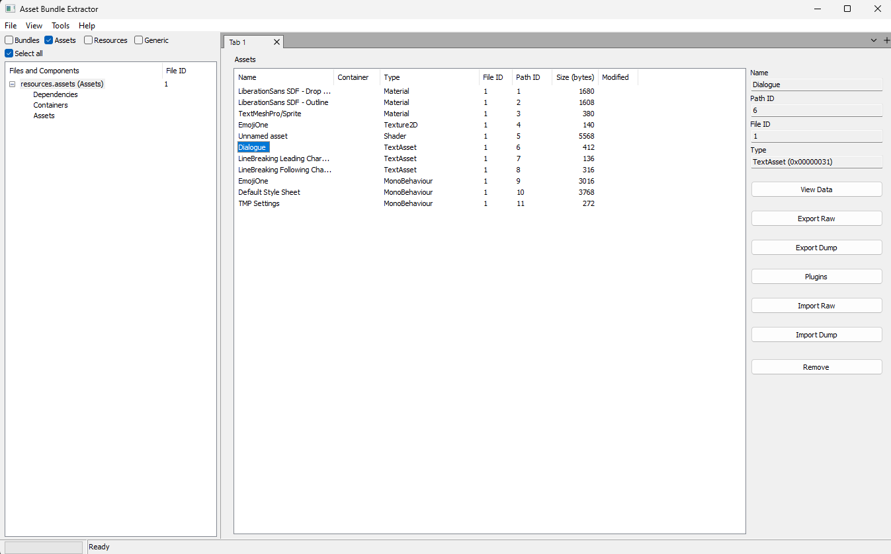

## 前言

> 作為資深玩家，當遇到沒有中文選項的遊戲時，第一反應往往是尋找漢化MOD。這些MOD的安裝方式各異，從簡單的下載安裝包到需要修改遊戲資源的複雜操作。使用過漢化的玩家都知道，有些漢化會在遊戲更新後失效(甚至需要移除)，但有些卻不受影響，這其中的差異是什麼原因造成的呢？
>
> 對於沒有漢化MOD的遊戲，且不懂遊戲語言的玩家，還有什麼方法可以理解遊戲內容呢？
>
> ⚠️文章內有較為簡單的遊戲解包，遊戲逆向的技術，這些技術是用來幫助我們理解遊戲的運作原理，以及漢化的手段。請勿用於不正當的用途，以及尊重知識產權。

最近因為工作關係，需要設計一些遊戲翻譯服務，在設計的途中接觸到一些遊戲漢化手段，當中有些技術手段個人覺得值得一看，部分技術整合到自己設計的服務裏面。於是乎想寫一篇文章來介紹一下這些技術手段~

> ⚠️翻譯質量問題本文章並不會詳細討論

## ~人工輸入加直接用翻譯服務~

所謂反璞歸真，最簡單的方法就是直接使用網上翻譯服務，例如 [Google Translate](https://translate.google.com/)、[DeepL](https://www.deepl.com/en/translator)等。優點是簡單，但是缺點是需要手動去輸入文本。不考慮翻譯質量，操作上也是很麻煩，需要不斷地切換遊戲和翻譯服務之間，影響遊玩體驗

而且還有一個關鍵問題是：

> 既然都不會原語言，怎麼會懂得輸入文本呢？


為了解決上述問題，在不修改遊戲的情況下，首先可以採用[OCR](https://zh.wikipedia.org/zh-tw/%E5%85%89%E5%AD%A6%E5%AD%97%E7%AC%A6%E8%AF%86%E5%88%AB)技術來幫助我們進行翻譯~

---

## OCR技術自動識別文字與翻譯

OCR技術(光學字符識別)通過截取遊戲畫面並識別其中的文字，再將識別結果傳送至翻譯服務，最後將翻譯結果以疊加或替換方式顯示在遊戲畫面上。這種方法不僅解決了"不懂輸入"的問題，同時實現了文字提取與翻譯的自動化流程，大幅提升了效率。

### OCR翻譯工具

#### Google Translate (Translate images)

Google Translate 提供了一個非常方便的功能 -- [Translate images](https://support.google.com/translate/answer/6142483)，可以直接將圖片中的文字翻譯成其他語言，這項技術的原理就是透過OCR識別文字，然后再翻譯成目標語言。

雖然在網頁版中，只提供了上傳圖片的功能，但在手機App中，則可以直接拍攝圖片甚至動態翻譯。（可以使用智能鏡頭無需拍照，然後它會自動幫你翻譯以及替換）


Translate images的優點是簡單易用，無需安裝任何軟件，只需要將圖片上傳到Google Translate即可。不過，缺點是需要用另一個設備開著智能鏡頭，而且翻譯結果也不會顯示在遊戲中。感覺就像：


<figcaption style="font-size: 1.4rem; color: var(--card-text-color-secondary); text-align: center;">Genius.jpg</figcaption>

話雖如此，這個功能當年在我玩 3DS 的時候還是非常好用的，當時的3DS很多遊戲并沒有中文化，那時候就靠著用iPad影住3DS幫我翻譯😂

#### MORT

MORT 是一個免費open source的Windows OCR 翻譯工具，是一個在電腦上不錯的選擇，對比起上述的智能鏡頭，MORT無需鏡頭就可以從螢幕上攝取。我曾經早期在玩BLUE PROTOCOL使用了MORT一會（~之後因爲封鎖外國ＩＰ就沒有再用了~），能應付到大部分情況。

Project地址:　[https://github.com/killkimno/MORT](https://github.com/killkimno/MORT)


MORT 支援多種翻譯服務，也可以自己implement翻譯API，以及自訂翻譯修正功能。它的使用方法也非常簡單，只需要設置 OCR 掃描區域，然後選擇翻譯服務即可。下面將簡單示範效果：


在操作與速度上，MORT基本上可以做到即時翻譯。基本上解決了我們人工輸入的問題，並且可以自動化翻譯過程。當然，這個工具也有一些缺點，例如需要手動設置 OCR 掃描區域，如果遊戲的文字顯示位置不固定，那么都需要經常調整掃描位置。

### 缺點

整體來說，OCR技術是目前最簡單的遊戲翻譯方法之一，無需修改遊戲資源，也不需要任何編程知識，只需要安裝一個OCR翻譯工具即可。

不過，這個方法的有一些缺點，或者說是這個技術的困難：

1. 對於一些具有藝術風格的文字，會出現明顯識別錯誤的情況，例如下圖，MORT提取到的文字是"SHAD WBRINGERS"，而實際上是"SHADOWBRINGERS"
   
   <figcaption style="font-size: 1.4rem; color: var(--card-text-color-secondary); text-align: center;">FFXIV Shadowbringers遊戲標題</figcaption>

2. 翻譯結果的顯示可能會影響遊戲的畫面顯示，或者會遮擋到遊戲，觀賞體驗會打折扣
   
   <figcaption style="font-size: 1.4rem; color: var(--card-text-color-secondary); text-align: center;">翻譯結果溢出了遊戲視窗</figcaption>

3. OCR技術的準確性取決於遊戲畫面的清晰度和文字的大小，如果畫面模糊/文字過小/遊戲畫面變化，則可能會導致識別錯誤

基本上缺點２和３是技術上難以解決的，那麼就有沒有其他方法可以解決這些問題呢？

---

## 從記憶體掃描提取文字

遊戲運行時，文字內容通常會被加載到渲染對象(Render Object)的記憶體空間中，再透過渲染函數(如`draw()`)顯示在畫面上。

這些文字在記憶體中是以二進制的形式存儲的，這意味著我們可以通過掃描遊戲運行時的記憶體來提取這些文字。

### 簡單演示

假設我們現在有以下的遊戲畫面，然后我們想提取畫面中的文字 (畫面中的字每10秒改變一次)：


1. 使用一些工具來掃描遊戲的記憶體 (這裏會使用[CheatEngine](https://github.com/cheat-engine/cheat-engine) )，首先我們直接從記憶體搜尋 `This is dialogue 7.` 。


> 這裡由於C#的特性，字符串會被編碼成[UTF-16](https://learn.microsoft.com/en-us/dotnet/csharp/language-reference/builtin-types/reference-types)，這裡會選擇UTF-16

2. 接著我們會得到一個地址列表，這些開地址都是包含`This is dialogue 7.`的地址
   
   最理想的情況下是第一次搜索然後裏面的內容會跟著畫面的字變動，這樣我們就可以知道這個地址是存放著畫面中的文字的地址。然而當畫面的文字出現變動的時候，我們會發現這個地址的內容並沒有變化
   
   這意味著這個地址並不是存放著畫面中的文字的地址，而是這段文字的**物件地址 (Object address)**


3. 透過分析這段文字附近的記憶體我們大概知道以下的訊息：
   - 這段記憶體附近存在其他的對話文本，然後這裏有重複出現的Magic Number `08 FC 4D 91 80 02 00 00` (圖片中黃色圈住的部分)
   - 紅色部分是我們的對話文本，這裡是`This is dialogue 7.`
   - 然後文本前面存在一個 `14 00` 的數字，這個數字是這段文字的長度，20個字，這裏比原本的長度多了1個字元，觀察最後的`00 0D`，發現這個是`[U+000D]`，是`\r`
  
    從這裡我們大概猜得出這個地址是對話文本的地址，也就是`String`，而前面Magic Number開始部分是`String`的Signature，然后4 bytes后面會跟文字的長度。

    那么我們知道這段文字的對象地址 (Object address)，然後我們可以去搜尋**誰指向這個地址 (who points to this address)**，這樣我們就可以知道這段文字是被誰引用 (理所當然地就是`渲染的對象`)


4. 在畫面中再一次顯示`This is dialogue 7.`的時候進行搜尋，我們發現有2個位置會指向這個Object，稍微再等一等畫面改變


5. 這時候我們會發現有一個位置的地址會跟著畫面中的文字變化，是另一段文字的地址，也即使是`This is dialogue 10.`的地址，跟著畫面中的文字相同，這意味著這個地址是存放著渲染畫面中的文字的地址。

這意味著我們可以透過上述相同的方法，首先找到這個`渲染Object`的Signature，然后再找出儲存文字的偏移量(Offset)，獲取文字Object的地址，再透過文字Object獲取到文字以及文字的長度，然後將其翻譯成目標語言，最後將翻譯結果顯示在遊戲畫面上。整體過程大概是這樣：

```C++
std::string ExtractGameText() {
    // 1. 搜索渲染Object
    void* renderObj = FindRenderObject(); 
    
    // 2. 透過渲染Object偏移取得文字Object
    void* textObj = *(void**)((uintptr_t)renderObj + TEXT_OBJECT_OFFSET);
        
    // 3. 透過文字Object取得文字
    short textLen = *(short*)((uintptr_t)textObj + 0x4);
    std::string gameText = ReadGameMemory((void*)((uintptr_t)textObj + 0x6), textLen);
        
    return gameText;
}
```

可能會有人問，為什麼不順便從渲染Object修改文字呢？因為通常直接修改文字都很大機會沒有即時反應或者會出現崩潰，有些渲染Object通常為了optimize渲染流程，通常都不會故意每一frame去重複，通常會有一個變量variable (例如 `isDirty`)控制、又或者一些變數權限問題、caching mechanism等等，從而導致修改失效。

不過在這個方法下，是可以直接從遊戲中提取文字，不會受到畫面清晰度和文字大小的影響。

### TataruHelper

TataruHelper 是一個用於 Final Fantasy XIV 的翻譯工具，通過[Sharlayan工具](https://github.com/FFXIVAPP/sharlayan)獲取到遊戲劇情的文字，然後將其翻譯成目標語言。

Project地址:　[https://github.com/NightlyRevenger/TataruHelper](https://github.com/NightlyRevenger/TataruHelper)


然後通過對TataruHelper-Sharlayan工具簡單的分析，可以看見其中他的[Reader.ChatLog.cs](https://github.com/NightlyRevenger/TataruHelper/blob/8141501284c5bdc102c331ed863f79d08e87d24e/Sharlayan/Reader.ChatLog.cs#L52)

```C#
public static ChatLogResult GetChatLog(int previousArrayIndex = 0, int previousOffset = 0)
{
    ...
    Signature ChatLogKey = Scanner.Instance.Locations[Signatures.ChatLogKey];

    var chatPointerMap = (IntPtr)Scanner.Instance.Locations[Signatures.ChatLogKey];

    if (chatPointerMap.ToInt64() <= 20)
    {
        return result;
    }

    List<List<byte>> buffered = new List<List<byte>>();

    try
    {
        var LineCount = (uint)MemoryHandler.Instance.GetPlatformUInt(chatPointerMap);

        ChatLogReader.Indexes.Clear();
        ChatLogReader.ChatLogPointers = new ChatLogPointers
        {
            LineCount = (uint)MemoryHandler.Instance.GetPlatformUInt(chatPointerMap),
            OffsetArrayStart = MemoryHandler.Instance.GetPlatformUInt(chatPointerMap, MemoryHandler.Instance.Structures.ChatLogPointers.OffsetArrayStart),
            OffsetArrayPos = MemoryHandler.Instance.GetPlatformUInt(chatPointerMap, MemoryHandler.Instance.Structures.ChatLogPointers.OffsetArrayPos),
            OffsetArrayEnd = MemoryHandler.Instance.GetPlatformUInt(chatPointerMap, MemoryHandler.Instance.Structures.ChatLogPointers.OffsetArrayEnd),
            LogStart = MemoryHandler.Instance.GetPlatformUInt(chatPointerMap, MemoryHandler.Instance.Structures.ChatLogPointers.LogStart),
            LogNext = MemoryHandler.Instance.GetPlatformUInt(chatPointerMap, MemoryHandler.Instance.Structures.ChatLogPointers.LogNext),
            LogEnd = MemoryHandler.Instance.GetPlatformUInt(chatPointerMap, MemoryHandler.Instance.Structures.ChatLogPointers.LogEnd),
        };

        ...
    }
    ...
}
```

就是透過`ChatLogKey`這個Signature來獲取到遊戲的對話文本對象 (`Line 4`)，然後再提取其相關信息 (`Line 20`)。

然後到翻譯工具本體，可以看見其中[FFMemoryReader.cs](https://github.com/NightlyRevenger/TataruHelper/blob/8141501284c5bdc102c331ed863f79d08e87d24e/FFXIVWpfApp1/FFHandlers/FFMemoryReader.cs#L327)

```C#
private async Task ChatReader()
{
    int _previousArrayIndex = 0;
    int _previousOffset = 0;

    ChatLogResult previousPanelResults = new ChatLogResult();

    while (_KeepWorking && _KeepReading)
    {
        try
        {
            ChatLogResult readResult = Reader.GetChatLog(_previousArrayIndex, _previousOffset);
            _previousArrayIndex = readResult.PreviousArrayIndex;
            _previousOffset = readResult.PreviousOffset;

            if (_UseDirectReadingInternal && _UseDirectReading)
            {
                var directDialog = Reader.GetDirectDialog();
                readResult.ChatLogItems.AddRange(directDialog.ChatLogItems);

                ClearMessagesList(readResult, previousPanelResults, directDialog);
            }

            var chatLogEntries = readResult.ChatLogItems;

            if (readResult.ChatLogItems.Count > 0)
            {
                for (int i = 0; i < readResult.ChatLogItems.Count; i++)
                {
                    ProcessChatMsg(readResult.ChatLogItems[i]);
                }
            }
        }
        catch (Exception e)
        {
            Logger.WriteLog(Convert.ToString(e));
        }

        await Task.Delay(GlobalSettings.MemoryReaderDelay);
    }
}

private void ProcessChatMsg(ChatLogItem chatLogItem)
{
    var tmpMsg = new FFChatMsg(chatLogItem.Line, chatLogItem.Code, chatLogItem.TimeStamp);
    _FFxivChat.Enqueue(tmpMsg);
}

```

然后下層則負責透過`ChatLogResult`處理對象，提取文字交給`ProcessChatMsg`負責，最後交給翻譯相關的API進行翻譯，然後將翻譯結果顯示在遊戲畫面上。
這樣就可以實現即時翻譯的效果，並且不會受到畫面清晰度和文字大小的影響。


### 缺點

在不考慮技術門檻的情況下，這個方法的唯一缺點就是它的翻譯結果的呈現方式缺少沉澱感，翻譯結果並不是顯示在原本的位置。那么有沒有方法可以直接修改遊戲顯示的文字呢？

## 靜態修改 - 修改遊戲資源

正常情況下遊戲資源都會分別儲存在一個`資源文件夾 (Assets)`裡面(例如Resoruces, AssetBundle)以方便管理，然后遊戲運行時對資源目錄讀取，例如角色的對話會儲存在TextAssets

> 想像一下如果角色的對話編寫再代碼裏面，如果要進行更改那麼是一件非常麻煩的事

靜態修改是指直接再遊戲運行前，修改遊戲資源文件中的文字，有安裝過漢化MOD的經驗的話相信對這個方法並不陌生，有些MOD就是直接覆蓋遊戲的部分檔案，原理就是把已經翻譯好的資源包 (Assets) 直接覆蓋進遊戲的資源位置，然後遊戲運行時就會直接使用這些已修改的資源(漢化后的文字)。

雖然表面表面上看就只是覆蓋資源文件，但其實這個方法的最困難的地方是如何找到`資源文件夾 (Assets)`、從中提取文字以及再一次封包，一般遊戲為了防止遭到修改和解包，以及optimize遊戲運行時的速度，遊戲的資源已經被打包成專用格式。

### 簡單演示


就以我們上一個例子的Demo示範，假設我們有以下的TextAssets (在Resources/dialogue)，而這些TextAssets就是畫面中的文字：

```txt
{
    "Hello"
    "This is dialogue 1."
    "This is dialogue 2."
    "This is dialogue 3."
    "This is dialogue 4."
    "This is dialogue 5."
    "This is dialogue 6."
    "This is dialogue 7."
    "This is dialogue 8."
    "This is dialogue 9."
    "This is dialogue 10."
}
```

1. 首先我們需要找到遊戲的位置


2. 觀察他的`Data`的資料夾，這個resources.assets就是我們的目標，當然無法直接打開


3. 這時候我們需要使用一些工具來解包這個資源包，這裡會使用[UABE](https://github.com/SeriousCache/UABE)



4. 然後我們可以在UABE中找到我們的TextAssets，然后對其進行修改，對其進行修改然后保存，然後再將其封包回去


5. 最後我們就可以看到修改后的結果了


> ⚠️正常情況下這裡的中文字會無法顯示，這裡為了示範已經預先把中文文字字型包打進來了遊戲裏面，後面會連同動態修改的部分一起說明這些方法的一些潛在問題

### 缺點

靜態修改的方法基本上解決了上述缺少沉澱感的缺點，但同帶來了一些潛在的問題

1. 技術含量門檻較高‌：對遊戲的資源包進行解包和封包，需要一些專業的工具和知識。顯示的Demo的是一個Unity的遊戲，因為已經有前人的工具可以使用，所以過程看起來比較簡單。但如果是其他引擎的遊戲，則需要自己去找工具或者自己寫工具來解包和封包。

2. **潛在的法律風險‌：不正當使用的情況下對遊戲進行解包是有機會侵犯遊戲的智慧財產權，當然如果取得遊戲官方的授權的話就沒有這方面的考量。**

3. ‌潛在穩定性風險‌：修改遊戲檔案可能導致程式崩潰或資料遺失，需備份原始檔案。(也是為什麼有些漢化模組會特登強調備份遊戲檔案的原因)

4. 模組的有效性‌風險‌：使用靜態修改漢化後，如果遊戲出現更新可能會導致修改的資源文件失效，因為原本的修改的資源包被更新成官方新版本的資源包，這樣舊的資源包就會被覆蓋掉從而失效。(也是為什麼有些漢化模組有時候會著遊戲更新後失效)

5. 額外的延伸問題需要處理，詳情請見 `7.1: 延伸`

## 動態修改 - Hook

動態修改是指在遊戲運行的時候，通過一些技術手段來修改遊戲的文件中的文字。這個方法的原理是通過`Hook`技術來攔截遊戲的渲染函數或者文字相關的函數，然後在渲染之前將文字進行翻譯。


手法上跟上面的`從記憶體掃描出文字位址`類似，但這個方法的核心不是去找`Object`的Signature，而是去找`函數 (Function)`。透過找到的相關函數，然後將其Hook，從中攔截`函數的參數(Function parameters)`，進行翻譯以及返回翻譯結果，然后再還原去原本的函數 (Function)。

雖然如此，這個方法的技術含量會比靜態修改高很多，因為Hook技術本身就需要一些底層的知識，一般而言通常都會使用到inline hook，如果對這個技術的原理以及實現有興趣，我建議可以觀看以下文章:

- [Inline Hooking for Programmers (Part 1: Introduction)](https://www.malwaretech.com/2015/01/inline-hooking-for-programmers-part-1.html)
- [Android inline hook 浅析](https://www.sunmoonblog.com/2019/07/15/inline-hook-basic/)

(如果有機會可能我都會自己實現一次，目前我都係直接使用別人已經寫好的Library)

### 簡單演示 (待更新)

(這部分網上已經有很多Desktop方面，暫時不提供示範，之後會開一篇文章講述如何對手機unity APK進行Hook漢化)

### BepInEx + XUnity.AutoTranslator

這裡將會介紹其中一個Unity遊戲常見的工具，BepInEx以及XUnity.AutoTranslator

BepInEx是一個開源的Unity遊戲模組框架，支持多種遊戲引擎，並且提供了許多API來幫助開發者進行遊戲模組的開發，BepInEx其中就有提供Unity方面的Hook API。

XUnity.AutoTranslator則是一個基於BepInEx的翻譯模組，可以自動將遊戲中的文字翻譯成目標語言。

- [BepInEx](https://github.com/BepInEx/BepInEx)
- [XUnity.AutoTranslator](https://github.com/bbepis/XUnity.AutoTranslator)

然後通過對XUnity.AutoTranslator的Hook Folder分析，可以看見其中對各種unity文字類別進行了Hook，例如`TextMeshPro`、`NGUI`、`UGUI`等等，我們可以直接看`TextMeshProHooks.cs`。

```C#
internal static class TextWindow_SetText_Hook
{
...
   static MethodBase TargetMethod(object instance)
   {
      return AccessToolsShim.Method(UnityTypes.TextWindow.ClrType, "SetText", new Type[] { typeof(string) });
   }
...
}

// TextGetterCompatHooks.cs
internal static class Text_text_Hook
{
    ...
  static void Postfix(object __instance, ref string __result)
   {
        TextGetterCompatModeHelper.ReplaceTextWithOriginal(__instance, ref __result);
   }
   ...
}
```

TMP是Unity的其中之一的文字渲染系統，在正常的Unity C# Code，如果要更改顯示的字就會呼叫 `SetText()`，從中看見XUnity.AutoTranslator會對其進行Hook，從而獲取文字，然后使用`ReplaceTextWithOriginal`。

```C#
[MethodImpl(MethodImplOptions.NoInlining)]
public static void ReplaceTextWithOriginal(object instance, ref string __result)
{
   if (!Settings.TextGetterCompatibilityMode || IsGettingText) return;

   var tti = instance.GetTextTranslationInfo();
   if (tti?.IsTranslated == true)
   {
      var originalAssembly = instance.GetType().Assembly;
      var withinGameCode = originalAssembly.IsAssemblyCsharp();
      if (withinGameCode)
      {
         // If the UI element is inside Assembly-CSharp it's not possible to tell if it's called by game code or UI code
         // This happens in NGUI, in which always replacing doesn't seem to cause any issues
         __result = tti.OriginalText;
      }
      else
      {
         // BUG: This seems to not be right, at least in the latest BepInEx5 there seems to be one less stack frame
         // 0. This method
         // 1. Postfix
         // 2. _Postfix
         // 3. Harmony-related trampoline method/MM_Detour
         // 4. Original method
         var callingMethod = new StackFrame(4).GetMethod();

         var callingAssembly = callingMethod.DeclaringType?.Assembly;

         if (!originalAssembly.Equals(callingAssembly))
         {
            // if the assembly is not the same, it may be call from the game or another mod, so replace
            __result = tti.OriginalText;
         }
      }
   }
}
```

然後在這裏處理替換成原本的文字，然後再將翻譯的文字傳回去。

### 優點

優點基本繼承了靜態修改的優點，並且解決了靜態修改的缺點，因為這個方法是直接在遊戲運行的時候進行翻譯，沒有對遊戲資源進行修改，翻譯文字與原文字是隔開的，所以不需要擔心遊戲更新導致的資源包失效問題。基本上遊戲沒有大改變的情況下，漢化效果是依然存在的。(也解釋了為什麼有些漢化模組不會受到遊戲更新影響)

### 缺點

缺點基本上是靜態修改的缺點，並且技術難度以及deubg比起其他方法是最困難的，以下是一些Hook常見的問題：

1. **Hook失敗**：有些遊戲會對Hook進行檢測，這樣會導致Hook失敗。除此之外，在使用inine hook的時候，Hook的function如果長度不足夠，則會導致Hook失敗 (沒有足夠的長度去注入jump指令)
2. **時機問題**：遊戲運行的時候會有很多Threadd在運行，在Proxy function的時候需要注意當前在哪一個Thread，那些Function可以使用及不可以 (Access Violation Problem)
3. **性能問題**：Proxy Function如果內部執行如果過多指令，則會導致遊戲性能下降

## 總結

總括來說，本文介紹的四種遊戲漢化技術方法如下：

| 技術方法        | 技術門檻 | 優點                                                         | 缺點                                                               |
| --------------- | -------- | ------------------------------------------------------------ | ------------------------------------------------------------------ |
| OCR技術自動識別 | 低       | 即裝即用，操作簡便                                           | 識別準確度問題(e.g: 對特殊字體/藝術字的識別率低)                   |
| 記憶體掃描提取  | 中       | 不受畫面品質影響                                             | 輸出位置需針對不同遊戲進行調整                                     |
| 靜態修改資源    | 高       | 翻譯效果最自然，完全融入遊戲界面，修改後無需持續運行翻譯程序 | 涉及遊戲檔案修改存在法律風險，遊戲更新會導致修改失效               |
| 動態Hook技術    | 高~極高  | 不直接修改遊戲檔案，對遊戲更新的適應性強                     | 開發和維護成本最高，可能影響遊戲穩定性，靜態修改資源問題，Hook問題 |

每種方法都有各自的好處和壞處以及最適合的使用場景，根據遊戲的特性和需求選擇從而產生不同的漢化方法的。

### 延伸

在這裡會簡單提及一些延伸的問題，這些問題是針對靜態修改和動態Hook的問題
1. **字型問題**：如果遊戲預設是沒有中文的，這意味著如果我們只是簡單地修改文字是不會有效果的(會出現亂碼的情況)，如果要顯示中文的話，則需要將中文字型包打進去遊戲裏面，而至於要怎樣將字型包打進去遊戲，就是另一個問題了。
2. **圖片問題**：如果遊戲的文字是以圖片的形式顯示的話，基本上只是修改文字是沒有用的，這時候就需要將圖片的資源包提取出來，然後再進行修改，然後再將其封包回去遊戲裏面。遊戲的圖片運氣好的話可能會提供原生的圖片資源，這樣就可以直接修改圖片了，但如果沒有的話，通常都是被打包成以及壓縮了(例如`DXT`,`ETC`)，需要有額外的工作處理。

除此之外非常建議可以閱讀一下這篇文章，這篇文章基本上講述了整個漢化的工作流程：

[游戏的汉化过程是怎样的？](https://www.zhihu.com/question/46282905/answer/1087459979)

## 後話

這篇文章是我在學習遊戲漢化的過程中，對於遊戲漢化的一些技術方法的總結。當然科技會不斷進步，這些方法也會隨著時間而改變，這篇文章只是針對目前的技術方法進行總結。希望這篇文章能夠幫助到對遊戲漢化技術手段有興趣的人。

## 參考資料

- Google Translate 圖片翻譯功能: https://support.google.com/translate/answer/6142483
- DeepL 翻譯器: https://www.deepl.com/en/translator  
- 維基百科 - OCR技術: https://zh.wikipedia.org/zh-tw/光學字符識別
- MORT 開源項目: https://github.com/killkimno/MORT
- Cheat Engine 工具: https://github.com/cheat-engine/cheat-engine
- TataruHelper 翻譯工具: https://github.com/NightlyRevenger/TataruHelper
- Sharlayan 遊戲記憶體讀取工具: https://github.com/FFXIVAPP/sharlayan
- UABE 資源解包工具: https://github.com/SeriousCache/UABE
- BepInEx 模組框架: https://github.com/BepInEx/BepInEx
- XUnity.AutoTranslator: https://github.com/bbepis/XUnity.AutoTranslator