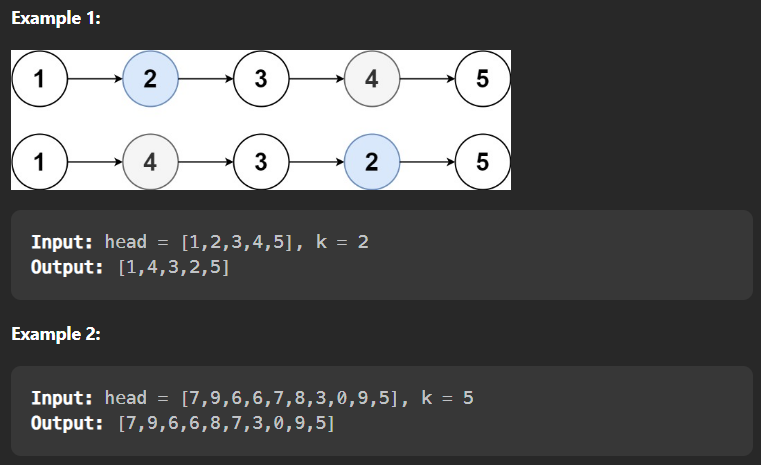
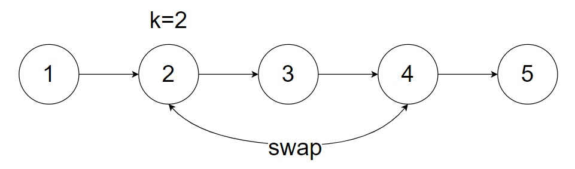
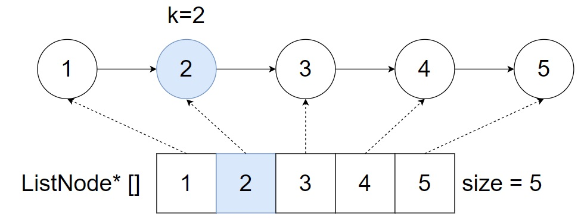
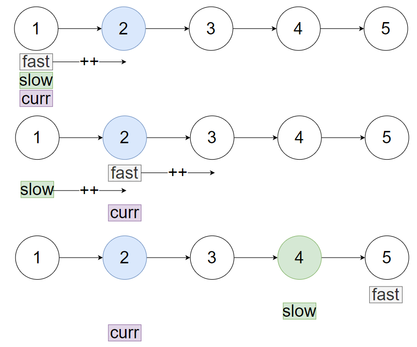

# Leetcode 1721. Swapping Nodes in a Linked List

>You are given the head of a linked list, and an integer k.
>
>Return the head of the linked list after swapping the values of the kth node from the beginning and the **kth** node from the end (the list is 1-indexed).



## 前言

作為一個Leetcode + Data structure菜鳥，一開始的解決方法都很直接。發現有什麼問題就直接暴力解決它。這一篇Blog最主要紀錄我前期的思考方式以及開始培養習慣，所以以下解法思路可能效率不高。

## 個人解法思路



1. 在list中先尋找第**k**個node為何。然後尋找它對應的node（即從尾端到開頭的第**k**個node），並將兩者交換。
2. swap實現方法相對簡單，不詳細說明
3. 將問題簡化成「如何在list中尋找第**k**的node和從尾端到開頭的第**k**個node」
4. 因為我們怎樣都要Travel整個Linked-list才知道整體長度（Linked-list特色），所以一開始用Array/Vector紀錄已經走過的node
5. 透過已紀錄的Array/Vector，就知道node的位置以及整體長度，從而解決了「如何在list中尋找第**k**的node和從尾端到開頭的第**k**個node」

## 解法 Solution



```C++
/**
 * Definition for singly-linked list.
 * struct ListNode {
 *     int val;
 *     ListNode *next;
 *     ListNode() : val(0), next(nullptr) {}
 *     ListNode(int x) : val(x), next(nullptr) {}
 *     ListNode(int x, ListNode *next) : val(x), next(next) {}
 * };
 */
class Solution {
public:
    ListNode* swapNodes(ListNode* head, int k) {
        vector<ListNode*> list;
        ListNode* curr = head;

        while(curr != NULL){
            list.push_back(curr);
            curr = curr->next;
        }

        int selected = k-1, mirror = list.size()-k;

        if(k == 1 || k == list.size() || (mirror-1 == selected) || (selected-1 == mirror)){
            int temp = list[selected]->val;
            list[selected]->val = list[mirror]->val;
            list[mirror]->val = temp;
            
        }else{
            list[selected-1]->next = list[mirror];
            list[selected]->next = list[mirror+1];

            list[mirror-1]->next = list[selected];
            list[mirror]->next = list[selected+1];
        }

        return list[0];
    }
};
```

Time complexity: $\mathcal{O}(n)$, $\mathcal n=number \space of\space nodes$

Space complexity: $\mathcal{O}(n)$, $\mathcal n=number \space of\space nodes$

## 更進一步思考

+ 這裏還有更加好的方法嗎？
+ 「怎樣都要Travel整個Linked-list才知道整體長度」→ Time complexity 已經沒有最佳化空間 → 那麼就從Space complexity改良
+ 有沒有方法可以節省空間？有，可以用pointer紀錄兩個位置 (fast/slow point)



1. 我們首先用fast pointer尋找第k的node
2. curr (current) = fast pointer
3. 然後slow fast pointer一起走
4. 透過上圖我們發現當fast到達終點時，剛好就是我們想要的對應node的位置

## 解法2 Solution2

```C++
/**
 * Definition for singly-linked list.
 * struct ListNode {
 *     int val;
 *     ListNode *next;
 *     ListNode() : val(0), next(nullptr) {}
 *     ListNode(int x) : val(x), next(nullptr) {}
 *     ListNode(int x, ListNode *next) : val(x), next(next) {}
 * };
 */
class Solution {
public:
    ListNode* swapNodes(ListNode* head, int k) {
      ListNode* slow = head;
      ListNode* fast = head;
      ListNode* curr;

      for(int i = 1; i < k; i++){
          fast=fast->next;
      }
      curr = fast;
      
      while(fast->next != NULL){
          slow=slow->next;
          fast=fast->next;
      }

      swap(curr->val,slow->val);
      
      return head;
    }
};
```
Time complexity: $\mathcal{O}(n)$, $\mathcal n=number \space of\space nodes$

Space complexity: $\mathcal{O}(1)$, 我們只用了三個pointer