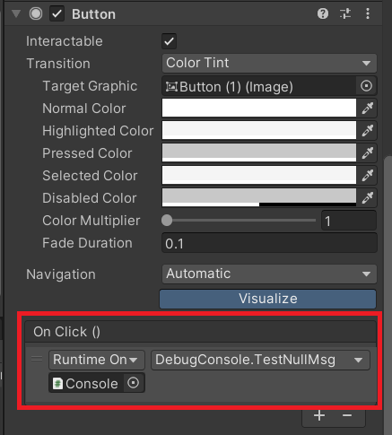
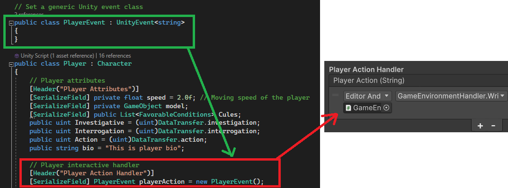

## UnityEvent

> Unity manual: <https://docs.unity3d.com/Manual/UnityEvents.html>

According to the manual, UnityEvents are a way of allowing user driven callback to be persisted from edit time to run time without the need for additional programming and script configuration. UnityEvents may sound very unfamiliar as it cannot directly added in a gameobject. However, if you used the UGUI Button before, you will understand it soon. As the `On click()` selection in the button is a kind of UnityEvents.



If we want to use the UnityEvent, we can simply using the class `UnityEvent`. After that, you can see the same selection in the inspector.



## Move deeply

Sometime we may want to pass some specific value to the callback function such as the enemy gameobject, however, if we look at the inspector, it dose not support to pass the gameobject, so how can we do it? Actually, we can using the generic form of the `UnityEvent<T0>`. Then, using `.Invoke(value)` to send to all listener.  

However, if you look at the code it may a bit complicated. So how can we assign a function into a `UnityEvent` without using generic? We can try to use `C# delegate`. Here is an example:

```C#
public class ValueController : MonoBehaviour
{
    private float number;
    private Button plus;
    private Button mins;

    public float offset = 10.0f;

    // initial the member
    private void Awake()
    {
        number = 0;
        plus = gameObject.transform.GetChild(0).GetComponent<Button>();
        mins = gameObject.transform.GetChild(1).GetComponent<Button>();
        
        plus.onClick.AddListener(delegate { EditVal(offset); });
        mins.onClick.AddListener(delegate { EditVal(-offset); });

    }

    private void EditVal(float val)
    {
       number += val;
    }
}
```

In this code, we assign the `EditVal()` function into the listener, when players click the `plus` button, the number will be increased by 10; when players click the `mins` button, the number will be decreased by 10. Most importantly, we havn't create any new UnityEvent in the script.

```C#
plus.onClick.AddListener(() => EditVal(offset));
```

Or using the lambda expressions.  

The reason why we need to use delegate/lambda expressions here because according to the Unity [documentaion](https://docs.unity3d.com/2018.3/Documentation/ScriptReference/Events.UnityEvent.AddListener.html), the ``UnityAction`` class here (The button ``OnClick()`` ) does not take any argument.

## Reference

1. [``UnityEvent`` Class](https://docs.unity3d.com/2018.3/Documentation/ScriptReference/Events.UnityEvent.html)

2. [Unity Manual](https://docs.unity3d.com/Manual/UnityEvents.html)
